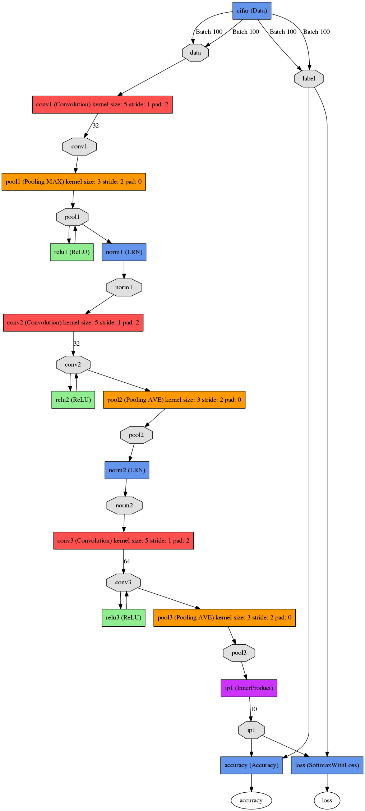

Alex's CIFAR-10 tutorial, Caffe style
=====================================

Alex Krizhevsky's [cuda-convnet](https://code.google.com/p/cuda-convnet/) details the model definitions, parameters, and training procedure for good performance on CIFAR-10. This example reproduces his results in Caffe.

We will assume that you have Caffe successfully compiled. If not, please refer to the [Installation page](/installation.html). In this tutorial, we will assume that your caffe installation is located at `CAFFE_ROOT`.

We thank @chyojn for the pull request that defined the model schemas and solver configurations.

*This example is a work-in-progress. It would be nice to further explain details of the network and training choices and benchmark the full training.*

Prepare the Dataset
-------------------

You will first need to download and convert the data format from the [CIFAR-10 website](http://www.cs.toronto.edu/~kriz/cifar.html). To do this, simply run the following commands:

    cd $CAFFE_ROOT
    ./data/cifar10/get_cifar10.sh
    ./examples/cifar10/create_cifar10.sh

If it complains that `wget` or `gunzip` are not installed, you need to install them respectively. After running the script there should be the dataset, `./cifar10-leveldb`, and the data set image mean `./mean.binaryproto`.

The Model
---------

The CIFAR-10 model is a CNN that composes layers of convolution, pooling, rectified linear unit (ReLU) nonlinearities, and local contrast normalization with a linear classifier on top of it all. We have defined the model in the `CAFFE_ROOT/examples/cifar10` directory's `cifar10_quick_train_test.prototxt`.

Training and Testing the "Quick" Model
--------------------------------------

Training the model is simple after you have written the network definition protobuf and solver protobuf files (refer to [MNIST Tutorial](../examples/mnist.html)). Simply run `train_quick.sh`, or the following command directly:

    cd $CAFFE_ROOT
    ./examples/cifar10/train_quick.sh

`train_quick.sh` is a simple script, so have a look inside. The main tool for training is `caffe` with the `train` action, and the solver protobuf text file as its argument.

When you run the code, you will see a lot of messages flying by like this:

    I0317 21:52:48.945710 2008298256 net.cpp:74] Creating Layer conv1
    I0317 21:52:48.945716 2008298256 net.cpp:84] conv1 <- data
    I0317 21:52:48.945725 2008298256 net.cpp:110] conv1 -> conv1
    I0317 21:52:49.298691 2008298256 net.cpp:125] Top shape: 100 32 32 32 (3276800)
    I0317 21:52:49.298719 2008298256 net.cpp:151] conv1 needs backward computation.

These messages tell you the details about each layer, its connections and its output shape, which may be helpful in debugging. After the initialization, the training will start:

    I0317 21:52:49.309370 2008298256 net.cpp:166] Network initialization done.
    I0317 21:52:49.309376 2008298256 net.cpp:167] Memory required for Data 23790808
    I0317 21:52:49.309422 2008298256 solver.cpp:36] Solver scaffolding done.
    I0317 21:52:49.309447 2008298256 solver.cpp:47] Solving CIFAR10_quick_train

Based on the solver setting, we will print the training loss function every 100 iterations, and test the network every 500 iterations. You will see messages like this:

    I0317 21:53:12.179772 2008298256 solver.cpp:208] Iteration 100, lr = 0.001
    I0317 21:53:12.185698 2008298256 solver.cpp:65] Iteration 100, loss = 1.73643
    ...
    I0317 21:54:41.150030 2008298256 solver.cpp:87] Iteration 500, Testing net
    I0317 21:54:47.129461 2008298256 solver.cpp:114] Test score #0: 0.5504
    I0317 21:54:47.129500 2008298256 solver.cpp:114] Test score #1: 1.27805

For each training iteration, `lr` is the learning rate of that iteration, and `loss` is the training function. For the output of the testing phase, **score 0 is the accuracy**, and **score 1 is the testing loss function**.

And after making yourself a cup of coffee, you are done!

    I0317 22:12:19.666914 2008298256 solver.cpp:87] Iteration 5000, Testing net
    I0317 22:12:25.580330 2008298256 solver.cpp:114] Test score #0: 0.7533
    I0317 22:12:25.580379 2008298256 solver.cpp:114] Test score #1: 0.739837
    I0317 22:12:25.587262 2008298256 solver.cpp:130] Snapshotting to cifar10_quick_iter_5000
    I0317 22:12:25.590215 2008298256 solver.cpp:137] Snapshotting solver state to cifar10_quick_iter_5000.solverstate
    I0317 22:12:25.592813 2008298256 solver.cpp:81] Optimization Done.

Our model achieved ~75% test accuracy. The model parameters are stored in binary protobuf format in

    cifar10_quick_iter_5000

which is ready-to-deploy in CPU or GPU mode! Refer to the `CAFFE_ROOT/examples/cifar10/cifar10_quick.prototxt` for the deployment model definition that can be called on new data.

Why train on a GPU?
-------------------

CIFAR-10, while still small, has enough data to make GPU training attractive.

To compare CPU vs. GPU training speed, simply change one line in all the `cifar*solver.prototxt`:

    # solver mode: CPU or GPU
    solver_mode: CPU

and you will be using CPU for training.


Training and Testing the "full" Model
--------------------------------------

full模型比quick模型迭代次数多，一共迭代70000次，前60000此学习率是0.001，中间5000次学习率是0.0001，最后5000次学习率是0.00001.

Simply run `train_full.sh`, or the following command directly:

    cd $CAFFE_ROOT
    ./examples/cifar10/train_full.sh


Test the model
-------------------
Use `classification.bin` to recognize a single picture

```
./build/examples/cpp_classification/classification.bin \
./examples/cifar10/cifar10_full.prototxt \  (模型描述文件)
./examples/cifar10/cifar10_full_iter_65000.caffemodel.h5 \  （训练好的caffemodel）
./examples/cifar10/mean.binaryproto \  (图像均值文件)
./data/cifar10/batches.meta.txt \ (图像类别标签信息) **注意：**  此标签可能是11类，因为最后一行有一个空格，需要删掉，否则和模型描述文件不符
./examples/images/fish-bike.jpg (此处可以是自己的图片)
```


About snapshot
-------------------

Snapshot的存储格式有两种，分别是BINARYPROTO格式和HDF5格式。BINARYPROTO是一种二进制文件，并且可以通过修改snapshot_fomat来设置存储类型。

该项的默认是BINARYPROTO。不管哪种形式，运行的过程都是类似的，都是从solver<Dtype>::Snapshot()函数进入，首先调用Net网络的方法，再操作网络中的每一层，最后调用write函数写入输出。

* BINARYPROTO格式

```
#snapshot_format:BINARYPROTO
```
    
生成`.caffemodel`

* Hdf5格式

```
snapshot_format: HDF5
```

生成`.caffemodel.h5`


Some Tricks
-------------------

1. save model architecture to image

```
python python/draw_net.py --rankdir TB examples/cifar10/cifar10_full_train_test.prototxt examples/cifar10/full_net.png
```



其中`--rankdir`表示图的方向,从上往下或者从左往右,默认从左往右

2. 可视化训练过程

caffe中其实已经自带了这样的小工具 caffe/tools/extra/parse_log.sh  caffe/tools/extra/extract_seconds.py和 caffe-master/tools/extra/plot_training_log.py.example ，使用方法如下：

i) 记录训练日志

在训练过程中的命令中加入一行参数,实现Log日志的记录

```
./build/tools/caffe train -solver examples/cifar10/cifar10_quick_solver.prototxt 2>&1 | tee examples/cifar10/quick.log
```

其中，`>&`表示所有的标准输出(stdout）和标准错误输出(stderr）都将被重定向到‘adamlenet.log’文件中，最后的&表示将命令放入后台执行。

ii) 解析训练日志

parse_log.py文件的作用就是：将你的日志文件分解成两个txt的文件。

```
./tools/extra/parse_log.sh quick.log
```

这样就会在当前文件夹下生成一个.train文件和一个.test文件

iii) 生成图片

执行:

```
./plot_training_log.py.example 6 train_loss.png quick.log
```

就可以生成训练过程中的Train loss  vs. Iters 曲线,其中6代表曲线类型， train_loss.png 代表保存的图片名称

caffe中支持很多种曲线绘制，通过指定不同的类型参数即可，具体参数如下:

```
Notes: 
    1. Supporting multiple logs. 
    2. Log file name must end with the lower-cased ".log". 
Supported chart types: 
    0: Test accuracy  vs. Iters 
    1: Test accuracy  vs. Seconds 
    2: Test loss  vs. Iters 
    3: Test loss  vs. Seconds 
    4: Train learning rate  vs. Iters 
    5: Train learning rate  vs. Seconds 
    6: Train loss  vs. Iters 
    7: Train loss  vs. Seconds 
```